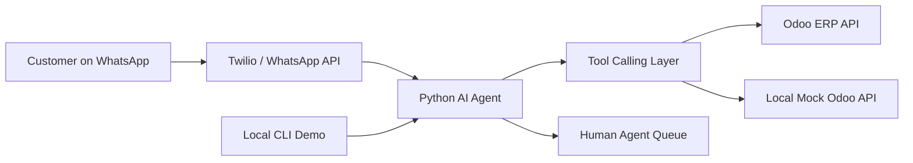

# WhatsApp AI Support Bot + Mock Odoo Demo

This is a local, self-contained prototype for a physical-store WhatsApp support bot.

It demonstrates:

- Mock Odoo inventory API.
- AI agent tool calls for inventory lookup.
- Human handoff detection for frustrated customers or explicit escalation requests.
- CLI chat simulation that stands in for WhatsApp/Twilio during a fast client demo.

## Architecture



For the prototype, `Local CLI Demo` replaces WhatsApp and `Local Mock Odoo API` replaces the real Odoo ERP.

## Run Locally

```bash
python -m venv .venv
.venv\Scripts\activate
pip install -r requirements.txt
uvicorn mock_odoo_api:app --reload
```

Open a second terminal:

```bash
.venv\Scripts\activate
python cli_chat.py
```

## Optional OpenAI Function Calling

The demo works without an API key using a deterministic local fallback.

To enable OpenAI tool/function calling:

```bash
set OPENAI_API_KEY=your_key_here
set USE_OPENAI=1
set OPENAI_MODEL=gpt-4.1-mini
python cli_chat.py
```

The implementation uses the current Chat Completions `tools` / `tool_calls` pattern. The older `functions` / `function_call` fields are deprecated in OpenAI's docs.

## Demo Script

Use these prompts:

```text
Do you have French press in stock?
Any promotions on chargers?
Where can I find yoga mats?
Do you have Bluetooth speakers?
I am angry, connect me to a human
```

Show the client the `Tool trace` after each answer. That proves the bot is not guessing: it is calling inventory and escalation tools.

## How This Scales To Real Odoo

The mock API has the same role as a future Odoo connector. In production, replace `mock_odoo_api.py` with an authenticated Odoo adapter that calls Odoo JSON-RPC/XML-RPC or a custom Odoo REST endpoint.

Suggested production modules:

- `odoo_client.py`: authenticates to Odoo and fetches product, stock, price list, and promotion fields.
- `agent.py`: keeps the tool schemas stable so the LLM always calls `search_inventory` and `human_handoff`.
- `whatsapp_webhook.py`: receives Twilio/Meta WhatsApp webhooks and forwards messages to the agent.
- `handoff_queue.py`: creates a ticket in Odoo Helpdesk, WhatsApp inbox, Slack, Zendesk, or a custom dashboard.

## Upwork Pitch Angle

Present this as a low-risk migration path:

1. The customer experience is already visible in the CLI.
2. The bot already separates AI reasoning from business data.
3. The mock Odoo API can be swapped for the client's real Odoo ERP without rewriting the conversation flow.
4. Human handoff is designed from day one, so the bot does not trap unhappy customers.
5. The same architecture can later support order lookup, loyalty points, returns, store hours, multilingual replies, and agent analytics.
